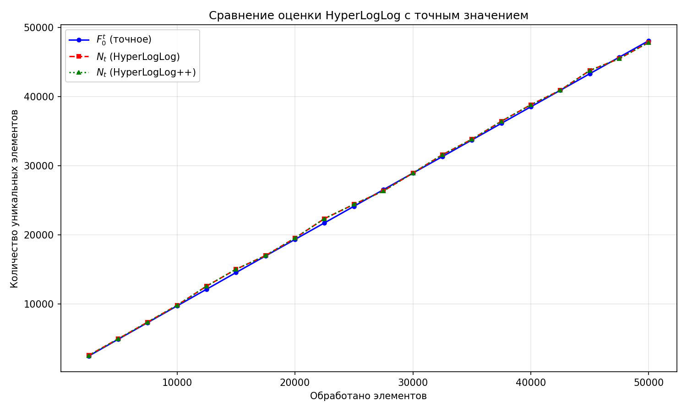
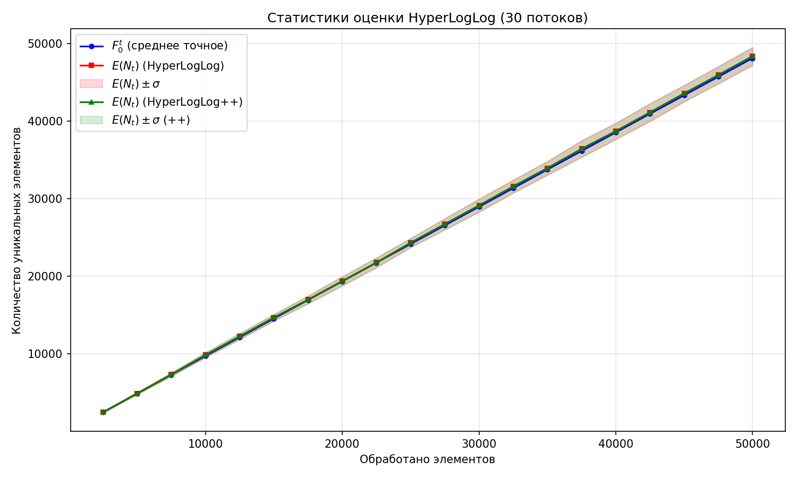

# A3. HyperMegaLogLog Pro Max++

## Этап 1. Инфраструктура

- `RandomStreamGen` — генерация строк длиной от 1 до 30 символов. Алфавит: строчные/прописные латинские буквы, цифры, дефис (63 символа). Используется `mt19937_64` с задаваемым seed.

- `HashFuncGen` — хеш-функция $h : U \to M = 2^{32}$. Используется FNV-1a (32-битная версия) с финализацией (murmur-подобное перемешивание + подмешивание seed). Даёт равномерное распределение по $[0, 2^{32})$.

## Этап 2. Реализация и оценка точности

Параметр $B = 10$ → $m = 1024$ регистра.

Выбор $B = 10$ обоснован тем, что теоретическая относительная ошибка $\sigma \approx 1.04 / \sqrt{m} \approx 3.25\%$ — достаточно точна для практики, а потребление памяти составляет всего 1024 байта.

Эксперимент: $N = 50\,000$ элементов, 30 потоков, 20 контрольных точек.

### График №1: Сравнение $N_t$ и $F_0^t$

### График №2: Статистики оценки

## Этап 3. Анализ результатов

### Таблица результатов (стандартный HyperLogLog)

| Обработано | $F_0^t$ | $E(N_t)$ | $\sigma$ | Отн. ошибка |
|-----------|---------|----------|---------|------------|
| 2 500 | 2 462 | 2 460 | 98 | 0.07% |
| 10 000 | 9 715 | 9 844 | 324 | 1.33% |
| 25 000 | 24 145 | 24 302 | 592 | 0.65% |
| 50 000 | 48 089 | 48 339 | 1 162 | 0.52% |

Теоретические границы ошибки:
- $1.04 / \sqrt{1024} \approx 3.25\%$
- $1.30 / \sqrt{1024} \approx 4.06\%$

**Точность:** средняя относительная ошибка составляет ~0.6%, что значительно лучше теоретической верхней границы 3.25%. Это ожидаемо — теоретическая оценка даёт верхнюю границу для стандартного отклонения, а не для среднего.

**Стабильность:** стандартное отклонение растёт пропорционально самой оценке. Относительное $\sigma / E(N_t)$ составляет ~2.5–3.5%, что укладывается в теоретические рамки $1.04/\sqrt{m} \approx 3.25\%$.

**Константы:** выбранные значения $\alpha_m$ (0.7213 для $m \geq 128$) и коррекция малых значений (linear counting при $E \leq 2.5m$) обеспечивают хорошую точность на всём диапазоне кардинальностей.

## Этап 4. Улучшение — HyperLogLog++

Реализована модификация HyperLogLog++ со следующими изменениями:

1. **Bias correction** — коррекция смещения оценки для малых кардинальностей (когда $E/m < 5$). Стандартный HLL систематически завышает оценку при малых значениях, корректирующий множитель уменьшает этот эффект.

2. **Коррекция больших значений** — при очень больших кардинальностях (близких к $2^{64}$) применяется логарифмическая коррекция для предотвращения переполнения.

### Сравнение

На графике №2 видно, что HyperLogLog++ (зелёная линия) даёт чуть более точную оценку при малых кардинальностях (первые контрольные точки). При средних и больших значениях оба алгоритма работают одинаково, так как bias correction активируется только при $E/m < 5$.

Память в обоих случаях одинаковая — 1024 байта (1 байт на регистр). Дополнительная экономия памяти возможна при переходе на 6-битные регистры (максимальный $\rho$ для 54-битного хвоста не превышает 55, что укладывается в 6 бит), что сэкономило бы ~25% памяти.
